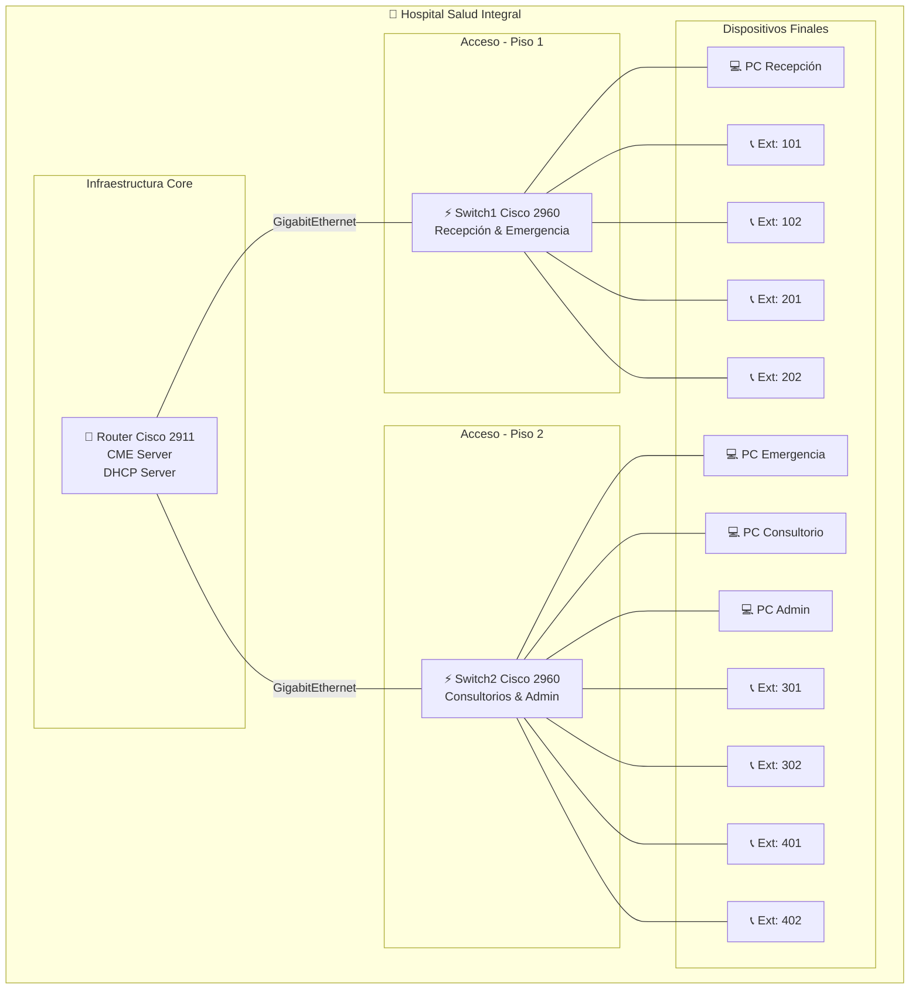

# 🏥 Telefonía IP para Hospital "Salud Integral"


## 📖 Descripción del Proyecto

Este proyecto implementa una **solución completa de Telefonía IP (VoIP)** para el Hospital General "Salud Integral" utilizando **Cisco Packet Tracer**. La implementación incluye configuración de VLANs, servicios DHCP, enrutamiento inter-VLAN y **Cisco Call Manager Express (CME)** para la gestión de llamadas.

### 🎯 Objetivos

- Migrar de telefonía analógica tradicional a VoIP
- Implementar segmentación de red mediante VLANs
- Configurar sistema de numeración telefónica departamental
- Demostrar integración de voz y datos en infraestructura convergente

## 🏗️ Arquitectura del Sistema

### Topología de Red



### Especificaciones Técnicas

| Componente | Modelo | Cantidad | Función |
|-----------|---------|----------|---------|
| **Router Core** | Cisco 2911 | 1 | CME, DHCP, Inter-VLAN Routing |
| **Access Switches** | Cisco 2960 | 2 | Conmutación L2, Voice VLAN |
| **IP Phones** | Cisco 7960 | 8 | Terminales VoIP |
| **PCs** | Desktop | 4 | Estaciones de trabajo |

## 🌐 Esquema de Direccionamiento

### Segmentación VLAN

| VLAN | Nombre | Subred | Rango Utilizable | Propósito |
|------|--------|--------|------------------|-----------|
| **10** | DATOS_HOSPITAL | 192.168.80.0/25 | .1-.126 | Tráfico de datos |
| **20** | VOZ_HOSPITAL | 192.168.80.128/25 | .129-.254 | Tráfico de voz |

### Plan de Numeración Telefónica

| Departamento | Extensiones | Descripción |
|-------------|-------------|-------------|
| **Recepción/Admisiones** | 101-102 | Atención inicial y registro |
| **Emergencias** | 201-202 | Atención de urgencias |
| **Consultorios Médicos** | 301-302 | Atención médica general |
| **Administración** | 401-402 | Gestión administrativa |

## 📁 Estructura del Proyecto

```plaintext
TIP1/
├── 📄 README.md                    # Este archivo
├── 📄 LICENSE                      # Licencia del proyecto
├── 📁 src/                         # Archivos de Packet Tracer
│   ├── Blank.pkt                   # Plantilla inicial
│   ├── C2811/                      # Implementación con router 2811
│   │   └── Caso_Hospital-2811.pkt
│   └── C2911/                      # Implementación principal
│       └── Caso_Hospital-2911.pkt
├── 📁 docs/                        # Documentación
│   ├── diagrams/
│   │   └── Topology.mmd            # Diagrama de topología
│   ├── guides/
│   │   └── guide.md                # Guía de implementación
│   └── pdfs/                       # Documentos de entrega
│       ├── CargasTrabajoTelefoniaIP.pdf
│       └── Implementación_de_Telefonía_IP_para_el_Hospital_General_Salud_Integral.pdf
```

## 📚 Documentación

- **[Guía de Implementación](docs/guides/guide.md)**: Pasos detallados de configuración
- **[Diagrama de Topología](docs/diagrams/Topology.mmd)**: Visualización de la arquitectura
- **[PDFs de Entrega](docs/pdfs/)**: Documentación formal del proyecto

## 🛠️ Tecnologías Utilizadas

- **Cisco Packet Tracer**: Simulación de red
- **VoIP**: Protocolo de voz sobre IP
- **VLAN**: Segmentación de red virtual
- **DHCP**: Asignación automática de direcciones
- **CME**: Cisco Call Manager Express
- **802.1Q**: Etiquetado de VLANs

## 🚀 Cómo Usar

1. **Clonar el repositorio**:

   ```bash
   git clone https://github.com/Yuzu02/TIP1-Hospital.git
   cd TIP1
   ```

2. **Abrir en Packet Tracer**:
   - Ejecutar `src/C2911/Caso_Hospital-2911.pkt`
   - O comenzar desde `src/Blank.pkt` siguiendo la guía

3. **Seguir la documentación**:
   - Revisar `docs/guides/guide.md` para pasos detallados
   - Consultar diagramas en `docs/diagrams/`

## 📞 Pruebas de Funcionalidad

- ✅ Llamadas internas entre departamentos
- ✅ Registro automático de teléfonos IP
- ✅ Separación de tráfico voz/datos
- ✅ Asignación DHCP automática
- ✅ Conectividad inter-VLAN

## 📄 Licencia

Este proyecto está bajo la Licencia MIT. Ver `LICENSE` para más detalles.

---
