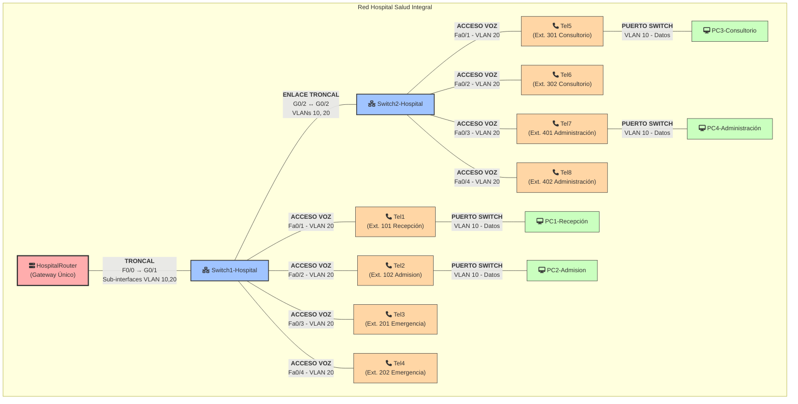

# 🏥 Telefonía IP para Hospital "Salud Integral"


## 📖 Descripción del Proyecto

Este proyecto implementa una **solución completa de Telefonía IP (VoIP)** para el Hospital General "Salud Integral" utilizando **Cisco Packet Tracer**. La implementación incluye configuración de VLANs, servicios DHCP, enrutamiento inter-VLAN y **Cisco Call Manager Express (CME)** para la gestión de llamadas.

### 🎯 Objetivos

- Migrar de telefonía analógica tradicional a VoIP
- Implementar segmentación de red mediante VLANs
- Configurar sistema de numeración telefónica departamental
- Demostrar integración de voz y datos en infraestructura convergente

## 🏗️ Arquitectura del Sistema

### Topología de Red ( Simplificada )


```mermaid
flowchart TD
    subgraph "Red Hospital Salud Integral"
        %% Definición de Nodos (Dispositivos) - Jerarquía Top-Down
        R1["<i class='fa fa-server'></i> HospitalRouter<br>(Gateway Único)"]
        SW1["<i class='fa fa-network-wired'></i> Switch1-Hospital"]
        SW2["<i class='fa fa-network-wired'></i> Switch2-Hospital"]
        
        %% Dispositivos del Switch 1 (Extensiones 101, 102, 201, 202)
        TEL1["<i class='fa fa-phone'></i> Tel1<br>(Ext. 101 Recepción)"]
        TEL2["<i class='fa fa-phone'></i> Tel2<br>(Ext. 102 Admision)"]  
        TEL3["<i class='fa fa-phone'></i> Tel3<br>(Ext. 201 Emergencia)"]
        TEL4["<i class='fa fa-phone'></i> Tel4<br>(Ext. 202 Emergencia)"]
        
        %% Dispositivos del Switch 2 (Extensiones 301, 302, 401, 402)
        TEL5["<i class='fa fa-phone'></i> Tel5<br>(Ext. 301 Consultorio)"]
        TEL6["<i class='fa fa-phone'></i> Tel6<br>(Ext. 302 Consultorio)"]
        TEL7["<i class='fa fa-phone'></i> Tel7<br>(Ext. 401 Administración)"]
        TEL8["<i class='fa fa-phone'></i> Tel8<br>(Ext. 402 Administración)"]
        
        %% PCs conectados a teléfonos específicos
        PC1["<i class='fa fa-desktop'></i> PC1-Recepción"]
        PC2["<i class='fa fa-desktop'></i> PC2-Admision"]
        PC3["<i class='fa fa-desktop'></i> PC3-Consultorio"]
        PC4["<i class='fa fa-desktop'></i> PC4-Administración"]

        %% Conexiones Jerárquicas Router-Switches
        R1 ---|"<b>TRONCAL</b><br/>F0/0 → G0/1<br/>Sub-interfaces VLAN 10,20"| SW1
        SW1 ---|"<b>ENLACE TRONCAL</b><br/>G0/2 ↔ G0/2<br/>VLANs 10, 20"| SW2
        
        %% Conexiones Switch1 - Teléfonos 1-4 (Fa0/1 a Fa0/4)
        SW1 ---|"<b>ACCESO VOZ</b><br/>Fa0/1 - VLAN 20"| TEL1
        SW1 ---|"<b>ACCESO VOZ</b><br/>Fa0/2 - VLAN 20"| TEL2
        SW1 ---|"<b>ACCESO VOZ</b><br/>Fa0/3 - VLAN 20"| TEL3
        SW1 ---|"<b>ACCESO VOZ</b><br/>Fa0/4 - VLAN 20"| TEL4
        
        %% Conexiones Switch2 - Teléfonos 5-8 (Fa0/1 a Fa0/4)
        SW2 ---|"<b>ACCESO VOZ</b><br/>Fa0/1 - VLAN 20"| TEL5
        SW2 ---|"<b>ACCESO VOZ</b><br/>Fa0/2 - VLAN 20"| TEL6
        SW2 ---|"<b>ACCESO VOZ</b><br/>Fa0/3 - VLAN 20"| TEL7
        SW2 ---|"<b>ACCESO VOZ</b><br/>Fa0/4 - VLAN 20"| TEL8
        
        %% Conexiones PCs a puertos Switch de teléfonos específicos
        TEL1 ---|"<b>PUERTO SWITCH</b><br/>VLAN 10 - Datos"| PC1
        TEL2 ---|"<b>PUERTO SWITCH</b><br/>VLAN 10 - Datos"| PC2
        TEL5 ---|"<b>PUERTO SWITCH</b><br/>VLAN 10 - Datos"| PC3
        TEL7 ---|"<b>PUERTO SWITCH</b><br/>VLAN 10 - Datos"| PC4
    end

    %% Estilos para mejorar la legibilidad
    style R1 fill:#ffadad,stroke:#333,stroke-width:3px
    style SW1 fill:#a0c4ff,stroke:#333,stroke-width:2px
    style SW2 fill:#a0c4ff,stroke:#333,stroke-width:2px
    style PC1 fill:#caffbf,stroke:#333,stroke-width:1px
    style PC2 fill:#caffbf,stroke:#333,stroke-width:1px
    style PC3 fill:#caffbf,stroke:#333,stroke-width:1px
    style PC4 fill:#caffbf,stroke:#333,stroke-width:1px
    style TEL1 fill:#ffd6a5,stroke:#333,stroke-width:1px
    style TEL2 fill:#ffd6a5,stroke:#333,stroke-width:1px
    style TEL3 fill:#ffd6a5,stroke:#333,stroke-width:1px
    style TEL4 fill:#ffd6a5,stroke:#333,stroke-width:1px
    style TEL5 fill:#ffd6a5,stroke:#333,stroke-width:1px
    style TEL6 fill:#ffd6a5,stroke:#333,stroke-width:1px
    style TEL7 fill:#ffd6a5,stroke:#333,stroke-width:1px
    style TEL8 fill:#ffd6a5,stroke:#333,stroke-width:1px
```

### Especificaciones Técnicas

| Componente | Modelo | Cantidad | Función |
|-----------|---------|----------|---------|
| **Router Core** | Cisco 2811 | 1 | CME, DHCP, Inter-VLAN Routing |
| **Access Switches** | Cisco 2960 | 2 | Conmutación L2, Voice VLAN |
| **IP Phones** | Cisco 7960 | 8 | Terminales VoIP |
| **PCs** | Desktop | 4 | Estaciones de trabajo |

## 🌐 Esquema de Direccionamiento

### Segmentación VLAN

| VLAN | Nombre | Subred | Rango Utilizable | Propósito |
|------|--------|--------|------------------|-----------|
| **10** | DATOS_HOSPITAL | 192.168.80.0/25 | .1-.126 | Tráfico de datos |
| **20** | VOZ_HOSPITAL | 192.168.80.128/25 | .129-.254 | Tráfico de voz |

### Plan de Numeración Telefónica

| Departamento | Extensiones | Switch | Descripción |
|-------------|-------------|--------|-------------|
| **Recepción/Admisiones** | 101-102 | Switch1 | Atención inicial y registro |
| **Emergencias** | 201-202 | Switch1 | Atención de urgencias |
| **Consultorios Médicos** | 301-302 | Switch2 | Atención médica general |
| **Administración** | 401-402 | Switch2 | Gestión administrativa |

## 📁 Estructura del Proyecto

```plaintext
TIP1/
├── 📄 README.md                    # Este archivo
├── 📄 LICENSE                      # Licencia del proyecto
├── 📁 src/                         # Archivos de Packet Tracer
│   ├── Blank.pkt                   # Plantilla inicial
│   └── C2811/                      # Implementación principal (única)
│       └── Caso_Hospital-2811.pkt
├── 📁 docs/                        # Documentación
│   ├── diagrams/
│   │   └── Topology.mmd            # Diagrama de topología
│   ├── guides/
│   │   ├── guide.md                # Guía de implementación
│   │   └── problems.md             # Problemas técnicos y resoluciones
│   └── pdfs/                       # Documentos de entrega
│       ├── CargasTrabajoTelefoniaIP.pdf
│       └──Implementación_de_Telefonía_IP_para_el_Hospital_General_Salud_Integral.pdf
```

## 📚 Documentación

- **[Guía de Implementación](docs/guides/guide.md)**: Pasos detallados de configuración
- **[Diagrama de Topología](docs/diagrams/Topology.mmd)**: Visualización de la arquitectura
- **[Problemas Técnicos y Resoluciones](docs/guides/problems.md)**: Incidencias encontradas durante la implementación
- **[PDFs de Entrega](docs/pdfs/)**: Documentación formal del proyecto

## 🛠️ Tecnologías Utilizadas

- **Cisco Packet Tracer**: Simulación de red
- **VoIP**: Protocolo de voz sobre IP
- **VLAN**: Segmentación de red virtual
- **DHCP**: Asignación automática de direcciones
- **CME**: Cisco Call Manager Express
- **802.1Q**: Etiquetado de VLANs

## 🚀 Cómo Usar

1. **Clonar el repositorio**:

   ```bash
   git clone https://github.com/Yuzu02/TIP1-Hospital.git
   cd TIP1
   ```

2. **Abrir en Packet Tracer**:
   - Ejecutar `src/C2811/Caso_Hospital-2811.pkt`
   - O comenzar desde `src/Blank.pkt` siguiendo la guía

3. **Seguir la documentación**:
   - Revisar `docs/guides/guide.md` para pasos detallados
   - Consultar diagramas en `docs/diagrams/`

## 📞 Pruebas de Funcionalidad

- ✅ Llamadas internas entre departamentos
- ✅ Registro automático de teléfonos IP
- ✅ Separación de tráfico voz/datos
- ✅ Asignación DHCP automática
- ✅ Conectividad inter-VLAN

## 🚨 Problemas Técnicos Resueltos

Durante la implementación se encontraron **3 incidencias técnicas principales** que fueron diagnosticadas y resueltas:

### 🔴 **Error de Solapamiento de Red (IP Overlap)**

- **Problema**: Router rechazaba configuración de subinterfaces por conflicto de direccionamiento
- **Causa**: Intento de duplicar misma subred en múltiples interfaces del router
- **Solución**: Cambio de arquitectura a topología en cascada con un solo punto de enrutamiento

### 🟡 **Fallo de Registro de Teléfonos IP**

- **Problema**: Teléfonos en Switch2 no obtenían dirección IP ni se registraban en CME
- **Causa**: Configuración incorrecta de VLAN de acceso en puertos de teléfonos
- **Solución**: Corrección de asignación VLAN (acceso=10, voz=20)

### 🟢 **Limitaciones de Hardware en Packet Tracer**

- **Problema**: Router C2911 no soporta `telephony-service` en simulación
- **Causa**: Limitaciones específicas del simulador Packet Tracer
- **Solución**: Migración completa a router C2811 con adaptación de interfaces

**📖 Ver detalle completo**: [Documentación de Problemas Técnicos](docs/guides/problems.md)

## 📄 Licencia

Este proyecto está bajo la Licencia MIT. Ver `LICENSE` para más detalles.

---
